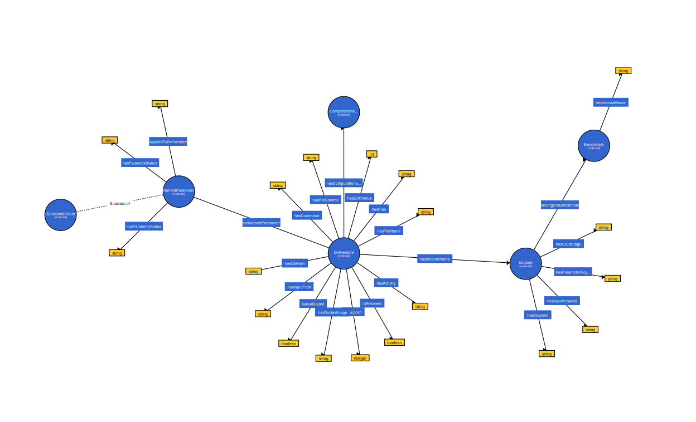

# Purpose

This is an ontology to annotate omnibenchmark runs.

We provide three components:
- the [ontology][ontology/ontology.ttl] formalization (turtle)
- an example [knowledgebase](knowledgebase/knowledgebase.ttl) (turtle) with a simplified setup:
  - one data module
  - two filtering modules
  - one method module, run with different parameters
- some SPARQL queries, including:
  - `get_deliverables_by_activity.sparql`
  - `get_deliverables_by_epoch.sparql`
  - `get_deliverables.sparql`
  - `get_file_provenances_one_hop.sparql`
  - `get_file_provenances_recursive.sparql`
  - `get_modules.sparql`

To generate these triples and send them to the endpoint: reuse [epoch.py from omni-cli](https://github.com/omnibenchmark/omni-cli/blob/main/omni_cli/epoch.py#L92), which mainly uses python native templating.

# Design philosophy

- Keep it deliverable-centric (file-centric), because bioinformatics workflows typically are.
- Reduce overlaps to renku's ontology but keep in mind future cross-queries; we can add federated queries and/or merge graphs by matching literals (i.e. plan ids or activity ids).
- Make use of gitLFS / S3 buckets identifiers, to streamline dataset retrieval in a renku-free manner.
- Make use of module names and file names, to perhaps switch to renku-free command-line workflows at some point.
- Keep versions/epochs explicit.

## Ontology layout

Layout generated by [WebVOWL 1.1.7](https://service.tib.eu/webvowl).

# Requirements

- [Specs](https://docs.google.com/spreadsheets/d/1bH4hsf8JDUkoUxzoq_iX3kV00RaTIkKTCMXwgoDFK2w/edit#gid=0)

# To remember

- Missing git hook/populate the endpoint on push
- To be linked to the container/codebase tagging/branching system
- (Sept 2023) Renku's named key:value parameters are named `parameterMaps` and only apply to composite plans, not to plans: [source](https://swissdatasciencecenter.github.io/renku-ontology/#ParameterMapping)
- [renkulab API queries](https://github.com/SwissDataScienceCenter/renku-graph/tree/51f4425c8f3abaa09fef6dab74013baf7ceafedb/knowledge-graph) (to potentially replace with our custom queries)
